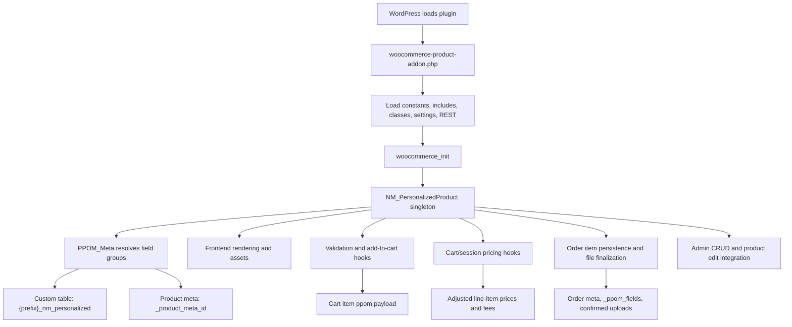
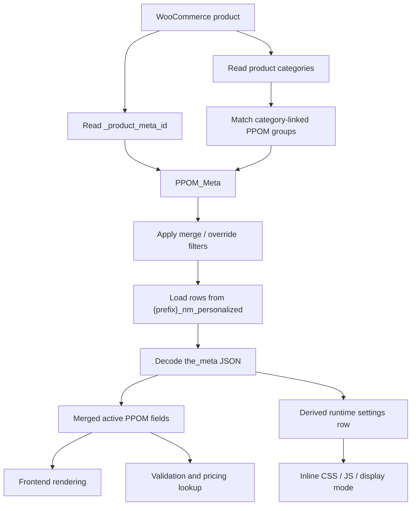
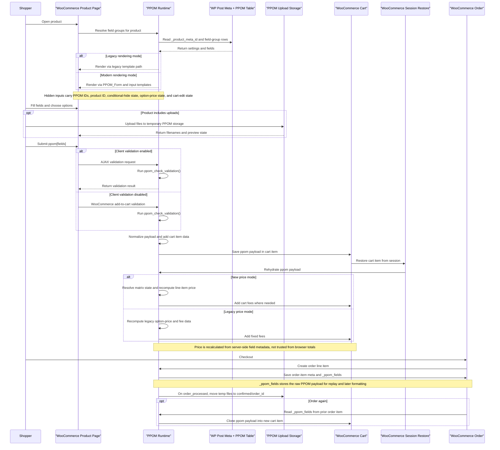
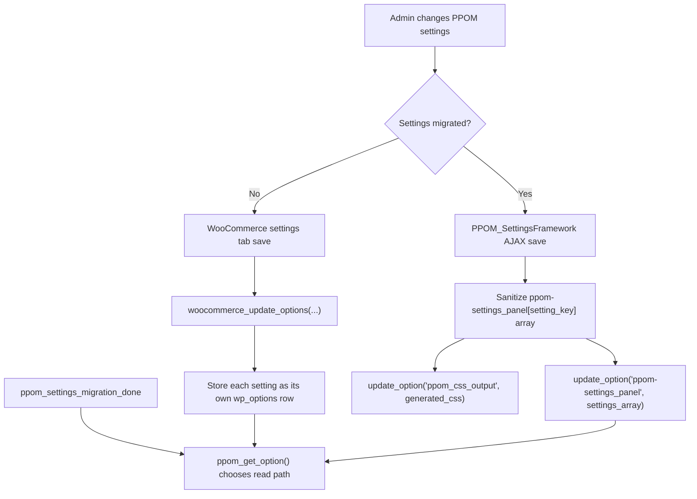

# PPOM Architecture

## Overview

PPOM extends WooCommerce products with configurable field groups. A field group adds extra product inputs such as text fields, selects, dates, uploads, quantities, price matrices, and other option types that affect:

- what the shopper can submit on the product page
- whether add to cart is allowed
- how cart and checkout prices are recalculated
- what metadata is stored on cart items and order items
- how uploaded files are stored and finalized after checkout

Conceptually, PPOM is a product-configuration layer on top of WooCommerce:

1. Admins create one or more PPOM field groups.
2. A product receives those groups directly or through category matching.
3. PPOM renders those fields on the product page.
4. Submitted values are validated and stored in the cart item.
5. PPOM recalculates price and fees from server-side field metadata.
6. PPOM persists readable metadata and raw payloads into the order item.
7. Uploaded files are moved from temporary storage into an order-scoped confirmed directory.

## Runtime Structure

### Bootstrap

The bootstrap lives in [`woocommerce-product-addon.php`](/Users/robert/Desktop/sites/plugins-dev/web/app/plugins/woocommerce-product-addon/woocommerce-product-addon.php). It:

- defines plugin constants such as `PPOM_PATH`, `PPOM_URL`, `PPOM_VERSION`, `PPOM_PRODUCT_META_KEY`, `PPOM_TABLE_META`, and `PPOM_UPLOAD_DIR_NAME`
- loads Composer autoload plus the procedural runtime files under [`inc/`](/Users/robert/Desktop/sites/plugins-dev/web/app/plugins/woocommerce-product-addon/inc)
- loads the class files under [`classes/`](/Users/robert/Desktop/sites/plugins-dev/web/app/plugins/woocommerce-product-addon/classes) and the settings framework under [`backend/`](/Users/robert/Desktop/sites/plugins-dev/web/app/plugins/woocommerce-product-addon/backend)
- registers translation loading on `init`
- declares HPOS compatibility on `before_woocommerce_init`
- instantiates admin-only services when `is_admin()`
- registers activation and deactivation hooks
- starts the main runtime on `woocommerce_init` by calling `PPOM()`

The plugin is not PSR-4 for its runtime code. The main file manually includes the plugin PHP files and then hands control to the `NM_PersonalizedProduct` singleton.

### Main Components

| Component | File | Responsibility |
| --- | --- | --- |
| Bootstrap | [`woocommerce-product-addon.php`](/Users/robert/Desktop/sites/plugins-dev/web/app/plugins/woocommerce-product-addon/woocommerce-product-addon.php) | Defines constants, loads the plugin, registers top-level hooks |
| Main runtime | [`classes/plugin.class.php`](/Users/robert/Desktop/sites/plugins-dev/web/app/plugins/woocommerce-product-addon/classes/plugin.class.php) | Registers WooCommerce hooks for rendering, validation, pricing, cart, orders, admin AJAX, cron, and loop behavior |
| Product field resolver | [`classes/ppom.class.php`](/Users/robert/Desktop/sites/plugins-dev/web/app/plugins/woocommerce-product-addon/classes/ppom.class.php) | Resolves applicable PPOM field groups for a product, merges their fields, and derives the runtime settings row from the custom DB table |
| Frontend form renderer | [`classes/form.class.php`](/Users/robert/Desktop/sites/plugins-dev/web/app/plugins/woocommerce-product-addon/classes/form.class.php) | Renders modern template-based product fields and hidden runtime state |
| Input registry | [`classes/input.class.php`](/Users/robert/Desktop/sites/plugins-dev/web/app/plugins/woocommerce-product-addon/classes/input.class.php) | Loads input-type classes and add-on input classes |
| Admin field UI | [`classes/fields.class.php`](/Users/robert/Desktop/sites/plugins-dev/web/app/plugins/woocommerce-product-addon/classes/fields.class.php) | Powers the field-group builder UI and admin-side assets |
| Admin coordinator | [`classes/admin.class.php`](/Users/robert/Desktop/sites/plugins-dev/web/app/plugins/woocommerce-product-addon/classes/admin.class.php) | Registers PPOM admin menus, settings integration, attach flows, and admin initialization hooks |
| Frontend asset loader | [`classes/frontend-scripts.class.php`](/Users/robert/Desktop/sites/plugins-dev/web/app/plugins/woocommerce-product-addon/classes/frontend-scripts.class.php) | Registers and localizes frontend JS and CSS for pricing, uploads, validation, conditions, and field widgets |
| Script registry | [`classes/scripts.class.php`](/Users/robert/Desktop/sites/plugins-dev/web/app/plugins/woocommerce-product-addon/classes/scripts.class.php) | Shared wrapper for registering, enqueuing, localizing, and inlining PPOM frontend assets |
| WooCommerce flow functions | [`inc/woocommerce.php`](/Users/robert/Desktop/sites/plugins-dev/web/app/plugins/woocommerce-product-addon/inc/woocommerce.php) | Product-page rendering, validation, cart item payloads, order item metadata, file finalization |
| Pricing engine | [`inc/prices.php`](/Users/robert/Desktop/sites/plugins-dev/web/app/plugins/woocommerce-product-addon/inc/prices.php) | Server-side option pricing, matrix pricing, cart fee calculation, line-item price updates |
| Upload subsystem | [`inc/files.php`](/Users/robert/Desktop/sites/plugins-dev/web/app/plugins/woocommerce-product-addon/inc/files.php) | AJAX upload and delete handlers, thumbnails, cropped files, confirmed-file storage, cleanup cron |
| Admin CRUD | [`inc/admin.php`](/Users/robert/Desktop/sites/plugins-dev/web/app/plugins/woocommerce-product-addon/inc/admin.php) | Field-group create/update/delete handlers and product-attachment UI |
| REST API | [`inc/rest.class.php`](/Users/robert/Desktop/sites/plugins-dev/web/app/plugins/woocommerce-product-addon/inc/rest.class.php) | Optional product and order PPOM API surface under `/wp-json/ppom/v1/` |

### Data and Resolution Model

PPOM stores field-group definitions in the custom table:

- `{prefix}_nm_personalized`

Each row contains both group-level settings and the full field definition payload. Important columns include:

- `productmeta_name`
- `dynamic_price_display`
- `productmeta_style`
- `productmeta_js`
- `productmeta_categories`
- `productmeta_tags` when extensions or add-ons use tag-aware assignment
- `the_meta` as JSON

Products are linked to PPOM groups through the normal post meta key:

- `_product_meta_id`

That value may contain one or more field-group IDs.

`PPOM_Meta` is the read-side resolution layer. For a given product, it:

1. reads `_product_meta_id`
2. checks category-linked groups
3. merges or overrides group IDs through filters
4. loads the matching row or rows from the custom table
5. merges field definitions from all matched groups
6. derives one active settings row for runtime values such as inline CSS, inline JS, price-display mode, and group title

The stable key throughout the whole runtime is the field `data_name`. PPOM uses that key in:

- posted form values: `$_POST['ppom']['fields'][data_name]`
- cart item payloads
- order item metadata
- field lookup helpers such as `ppom_get_field_meta_by_dataname()`

### Input Type System

The input system is split into two sides:

- PHP input classes in [`classes/inputs/`](/Users/robert/Desktop/sites/plugins-dev/web/app/plugins/woocommerce-product-addon/classes/inputs)
- frontend templates in [`templates/frontend/inputs/`](/Users/robert/Desktop/sites/plugins-dev/web/app/plugins/woocommerce-product-addon/templates/frontend/inputs)

`PPOM_Inputs` loads input classes dynamically from files such as `input.text.php`, `input.select.php`, `input.file.php`, and add-on input classes through filters like `nm_input_class-{type}`.

This gives PPOM a modular input model:

- admin-side field builder metadata comes from the input classes
- frontend rendering comes from the matching templates
- add-ons can register more input types without changing the main bootstrap

## WooCommerce Lifecycle

The best way to understand the plugin is to follow the data from product page to order item.

### 1. Product Page Rendering

The main runtime hooks into WooCommerce product pages through `woocommerce_before_add_to_cart_button`.

PPOM supports two rendering modes:

- legacy mode via `ppom_woocommerce_show_fields()` and [`templates/render-fields.php`](/Users/robert/Desktop/sites/plugins-dev/web/app/plugins/woocommerce-product-addon/templates/render-fields.php)
- modern mode via `ppom_woocommerce_inputs_template_base()`, `PPOM_Form`, and [`templates/frontend/ppom-fields.php`](/Users/robert/Desktop/sites/plugins-dev/web/app/plugins/woocommerce-product-addon/templates/frontend/ppom-fields.php)

The modern path renders:

- the active field groups
- a price-table container
- hidden inputs and wrapper state through `PPOM_Form::form_contents()`

That hidden form state is what keeps the frontend JS and backend PHP in sync.

### 2. Frontend Assets and Client Behavior

`PPOM_FRONTEND_SCRIPTS` registers the asset catalog and enqueues only the assets required for the current product or shortcode render.

It is responsible for:

- base PPOM styles and scripts
- field-type-specific assets such as datepicker, cropper, zoom, slider, tooltip, file upload, and input mask libraries
- localization of product price, field metadata, nonce values, upload paths, labels, conditional rules, and other runtime data
- injecting inline CSS and inline JS defined on the field group itself

The result is a configuration-driven frontend: PHP serializes field and product state into JS, then the browser uses that data for price tables, conditions, upload UI, and optional client-side validation.

### 3. Add to Cart and Validation

The add-to-cart phase is where PPOM turns form input into a cart payload.

Important hooks:

- `woocommerce_add_to_cart_validation`
- `woocommerce_add_cart_item_data`
- `woocommerce_add_to_cart_quantity`
- `woocommerce_add_to_cart_redirect`

Key behaviors:

- validation logic runs through `ppom_check_validation()`
- conditionally hidden fields are skipped during validation
- checkbox and min/max-like rules are enforced through field-aware helpers and hooks
- the submitted PPOM payload is stored under `$cart_item['ppom']`
- shortcode renders can redirect directly to the cart after add to cart

Validation can reach `ppom_check_validation()` in two ways:

- through `woocommerce_add_to_cart_validation` when client validation is disabled
- through the PPOM AJAX validation endpoint when client validation is enabled

### 4. Cart, Session Restore, and Pricing

After add to cart, PPOM extends WooCommerce cart behavior through hooks such as:

- `woocommerce_get_cart_item_from_session`
- `woocommerce_cart_loaded_from_session`
- `woocommerce_cart_calculate_fees`
- `woocommerce_cart_item_quantity`
- `woocommerce_cart_item_subtotal`
- `woocommerce_widget_shopping_cart_before_buttons`

Pricing is recalculated on the server from saved field metadata, not trusted from the browser.

The pricing layer can handle:

- option surcharges
- one-time charges
- quantity-driven pricing
- bulk quantity ranges
- price matrix rows
- measure-based pricing
- fixed-price addons
- discounts that apply to base price or base-plus-options

PPOM has two price modes:

- `new`, where product line-item prices are recalculated directly and some charges become cart fees
- `legacy`, where more behavior stays in the older fee-based flow and relies more on the hidden option-price payload

This stage also controls quantity display, mini-cart behavior, and cart-weight adjustments when PPOM fields change product characteristics.

### 5. Order Persistence and File Finalization

When WooCommerce creates order line items, PPOM persists both a readable view and a raw replayable view of the submitted data.

Important hooks:

- `woocommerce_checkout_create_order_line_item`
- `woocommerce_order_item_display_meta_key`
- `woocommerce_order_item_display_meta_value`
- `woocommerce_order_item_get_formatted_meta_data`
- `woocommerce_checkout_order_processed`
- `woocommerce_order_again_cart_item_data`

Order persistence does three things:

- saves readable field values into order item meta
- saves the raw PPOM payload into `_ppom_fields`
- reformats labels and values for files, cropper outputs, and option displays

File finalization is a separate later step. On `woocommerce_checkout_order_processed`, `ppom_woocommerce_rename_files()` moves files from temporary storage into `confirmed/{order_id}/` and prefixes filenames with product ID. `order again` support works by cloning `_ppom_fields` back into a new cart item.

### 6. Catalog and Product-Edit Behavior

PPOM also affects normal WooCommerce product behavior outside the checkout pipeline.

On the storefront it:

- changes loop add-to-cart URLs so configurable products lead to the single-product page
- changes the loop button text to a select-options style CTA
- disables `ajax_add_to_cart` support when PPOM input is required

In wp-admin it:

- adds a product-side PPOM selection UI through either a legacy meta box or a product data tab/panel
- duplicates PPOM attachments when products are duplicated

## Operational Subsystems

### Upload Subsystem

Uploads live under:

- `wp-content/uploads/ppom_files/`

Important subdirectories include:

- `thumbs/`
- `cropped/`
- `edits/`
- `confirmed/{order_id}/`

The upload subsystem handles:

- AJAX upload and delete endpoints for guests and logged-in users
- nonce verification
- mime-type and extension checks
- thumbnail generation
- cropper support
- cleanup of stale temporary uploads

On activation, PPOM schedules the cleanup hook `do_action_remove_images`, which removes temporary uploads older than 7 days.

### Admin and Settings

The admin side has two main responsibilities:

- field-group CRUD
- settings and permissions

Field-group management is split across `NM_PersonalizedProduct_Admin`, `PPOM_Fields_Meta`, and the AJAX CRUD handlers in [`inc/admin.php`](/Users/robert/Desktop/sites/plugins-dev/web/app/plugins/woocommerce-product-addon/inc/admin.php):

- create, edit, clone, and delete field groups
- bulk-attach field groups to products
- choose which group is attached on the product edit screen

`PPOM_Meta` is not the CRUD layer. It resolves product-side field groups and reads their settings/fields at runtime.

Settings use two storage models:

- legacy WooCommerce settings-tab storage
- the newer `PPOM_SettingsFramework`

`ppom_get_option()` abstracts over both so the runtime can read settings without caring which backend currently stores them.

#### How settings are stored in the database

PPOM settings are stored in `wp_options`, but the shape depends on whether settings migration has been completed.

Legacy storage:

- the old WooCommerce settings tab calls `woocommerce_update_options( ppom_array_settings() )`
- each setting is stored as its own option row
- examples include keys such as `ppom_legacy_price`, `ppom_enable_legacy_inputs_rendering`, `ppom_new_conditions`, `ppom_permission_mfields`, and `ppom_label_product_price`

Migrated storage:

- `PPOM_SettingsFramework` sets its save key to `ppom-settings_panel`
- the settings form posts values as `ppom-settings_panel[setting_key]`
- the AJAX save handler sanitizes the array and stores the whole settings payload in a single option row: `ppom-settings_panel`
- generated CSS derived from settings is stored separately in `ppom_css_output`

Migration state:

- `ppom_settings_migration_done = 1` tells `ppom_get_option()` to read from `ppom-settings_panel`
- if that flag is absent, `ppom_get_option()` falls back to reading individual legacy option keys
- the migration process copies existing legacy per-key options into `ppom-settings_panel`; it does not need to delete the old option rows in order for runtime reads to switch over

Related operational options:

- `personalizedproduct_db_version` tracks the plugin schema version for the custom PPOM table
- `ppom_legacy_user` is a separate flag used to detect whether an installation should be treated as a legacy user for some admin behavior

### REST API

If API access is enabled, `PPOM_Rest` registers routes under:

- `/wp-json/ppom/v1/`

The API supports:

- reading product PPOM field-group metadata
- creating or updating product PPOM field definitions
- deleting some or all product PPOM fields
- reading order PPOM metadata
- updating order PPOM metadata
- deleting order PPOM metadata

The important implementation detail is that the routes use open permission callbacks, while write operations validate a PPOM secret key inside the handler. That makes the API optional and configuration-gated, but still part of the plugin's public integration surface.

## Extension and Compatibility Model

PPOM is designed to be extended through filters, actions, template overrides, and companion plugins.

Common extension seams include:

- template path override via `ppom_input_templates_path`
- input rendering hooks such as `ppom_rendering_inputs` and `ppom_rendering_inputs_{type}`
- price hooks such as `ppom_cart_line_total`, `ppom_option_price`, and `ppom_price_mode`
- field resolution hooks such as `ppom_product_meta_id`
- metadata formatting hooks such as `ppom_order_display_value`
- input-class loading through `nm_input_class-{type}`

The plugin also has explicit compatibility seams for:

- PPOM Pro feature gating through `defined( 'PPOM_PRO_PATH' )`
- Themeisle SDK and freemium UI
- WPML and Polylang translation support
- Elementor shortcode rendering
- wholesale-pricing and currency-switcher integrations
- invoice and order-export plugins

Important runtime variants are controlled by settings:

- legacy vs modern field rendering
- legacy vs new price calculation
- legacy vs new conditional-logic script
- legacy vs migrated settings storage

## Database Inventory

PPOM stores data in several WordPress and WooCommerce persistence layers.

### Custom database table

- `{prefix}_nm_personalized`
  Stores PPOM field-group definitions and group-level settings such as `productmeta_name`, `dynamic_price_display`, `productmeta_style`, `productmeta_js`, category assignment, optional tag data for extensions/add-ons, and `the_meta` JSON.

### WordPress post meta

- `_product_meta_id`
  Attached to WooCommerce products and used to link one or more PPOM field groups to the product.

### WooCommerce cart and order item data

- `$cart_item['ppom']`
  Runtime cart payload containing submitted fields, conditional-hide state, option-price data, and other PPOM state.
- order item meta entries keyed by field `data_name`
  Human-readable PPOM values persisted into the order line item.
- `_ppom_fields`
  Raw PPOM payload stored on the order item so PPOM can format values later and rebuild cart data for `order again`.

### WordPress options

- `ppom-settings_panel`
  Single-array settings storage used by the migrated settings framework.
- `ppom_settings_migration_done`
  Flag that switches runtime setting reads from legacy per-key options to `ppom-settings_panel`.
- `ppom_css_output`
  Generated CSS derived from settings-framework values.
- legacy per-key options such as `ppom_legacy_price`, `ppom_enable_legacy_inputs_rendering`, `ppom_new_conditions`, `ppom_permission_mfields`, and pricing-label options
  Used before migration, and still available as the fallback read path when migration is not enabled.
- `personalizedproduct_db_version`
  Tracks the schema version for the custom PPOM table.
- `ppom_legacy_user`
  Marks whether an installation should be treated as a legacy user for some admin-side behavior.
- `ppom_demo_meta_installed`
  Marks whether the demo PPOM field group has already been inserted on activation.

### Upload storage

- `wp-content/uploads/ppom_files/`
  Temporary upload area.
- `wp-content/uploads/ppom_files/thumbs/`
  Generated thumbnails.
- `wp-content/uploads/ppom_files/cropped/`
  Cropper output files.
- `wp-content/uploads/ppom_files/edits/`
  Edited files.
- `wp-content/uploads/ppom_files/confirmed/{order_id}/`
  Finalized order-scoped file storage after checkout.

## Security Model

The main trust boundaries in the plugin are:

- posted PPOM field payloads
- frontend-computed option-price state
- uploaded files
- admin CRUD requests
- REST write requests

The runtime tries to protect those boundaries by:

- using nonce checks for admin AJAX and frontend AJAX actions
- checking roles and capabilities for admin operations
- validating add-to-cart data on the server
- recalculating prices from server-side field metadata
- restricting dangerous file types and owning the upload directories
- relying on WooCommerce cart and order APIs for persistence

The highest-risk areas are pricing, file handling, and any place where a field `data_name` must map back to the correct field definition.

## Contributor Mental Model

When changing PPOM, follow this sequence:

1. How does the product receive the field group?
2. How does `PPOM_Meta` resolve the active fields?
3. How is that field metadata rendered into HTML and JS?
4. Which `data_name` keys get posted back?
5. How does that payload get validated and stored in the cart item?
6. How does the server recalculate price and fees from the saved payload?
7. How does the order item store both readable metadata and `_ppom_fields`?
8. Does the change affect uploads, quantity rules, conditions, session restore, or product-loop behavior?

If a change fits that path cleanly, it is usually aligned with the plugin's actual architecture.
