# React Field Modal Agent Guide

## Scope

This folder owns the opt-in React admin field modal for PPOM field groups. It replaces the classic field editing shell only when `ppom_use_react_field_modal()` is true, usually through `PPOM_USE_REACT_FIELD_MODAL`, `?ppom_react_modal=1`, or the `ppom_use_react_field_modal` filter.

The canonical saved payload is still the legacy PPOM field row array stored in `{prefix}_nm_personalized.the_meta`. React is an editing shell around that payload, not a new storage model.

## Entry Points

- `src/index.tsx`: mounts React into `#ppom-field-modal-root`, installs the REST nonce middleware from `window.ppomFieldModalBoot`, registers widgets and field UI definitions, and wraps the app in Chakra.
- `src/App.tsx`: composes the modal frame, body, footer, picker/manage modes, close confirmation, and back behavior.
- `src/hooks/useFieldModalController.ts`: owns async orchestration for context loading, schema loading, saving, selection, dirty state, and picker transitions.
- `src/state/modalReducer.ts`: pure synchronous state transitions only.
- `src/adapters/wpAdminFieldModalAdapter.ts`: bridges classic admin buttons into React by listening to `.ppom-react-field-modal-open` and capturing `.ppom-edit-field` clicks before legacy jQuery opens the PHP modal.
- `src/services/fieldModalApi.ts`: REST transport for context, field type schema, and save calls.
- PHP support lives in `src/Admin/FieldModal/*`. The root container is rendered from `templates/admin/ppom-fields.php`.

## Current Workflow

```mermaid
flowchart TD
    A["Admin field editor page"] --> B{"React modal enabled?"}
    B -->|No| C["Classic PHP inline modal"]
    B -->|Yes| D["Render #ppom-field-modal-root and enqueue build"]

    D --> E["index.tsx boots React on domReady"]
    E --> F["apiFetch nonce middleware from ppomFieldModalBoot"]
    F --> G["App -> useFieldModalController"]

    G --> H["Bind open triggers"]
    H --> I["Add field button .ppom-react-field-modal-open"]
    H --> J["Edit row button .ppom-edit-field captured before legacy jQuery"]

    I --> K["OPEN entry=picker"]
    J --> L["OPEN entry=manage with selectFieldIndex"]

    K --> M["GET ppom/v1/admin/field-groups/context"]
    L --> M

    M --> N["FieldModalRestController::get_context"]
    N --> O["FieldModalSchemaBuilder catalog + groups"]
    N --> P["Existing group row + decoded fields"]
    N --> Q["License, upsell, conditional repeater flags"]

    O --> R["LOAD_CONTEXT_SUCCESS"]
    P --> R
    Q --> R

    R --> S["withClientIds(fields)"]
    S --> T{"pickerOpen?"}

    T -->|Yes| U["FieldPickerPanel -> FieldTypePicker"]
    U --> V["addFieldOfType(slug)"]
    V --> W["ADD_FIELD_ROW default row"]
    W --> X["pickerOpen=false; selectedId=new row"]

    T -->|No| X["Select existing/first field"]

    X --> Y["FieldManagePanel"]
    Y --> Z["FieldManageEditorBridge"]
    Z --> AA["TanStack Form owns active row values"]
    AA --> AB["onChange -> PATCH_FIELD_ROW_FROM_FORM"]
    AB --> AC["dirtyClientIds computed by stable serialized snapshots"]

    Z --> AD{"Route for field slug"}
    AD -->|definition| AE["DefinitionDrivenFieldEditor"]
    AD -->|legacyPhp/unknown| AF["UnknownSlugPanel + classic fallback CTA"]

    AE --> AG{"Schema source"}
    AG -->|local definition schema| AH["Use registered FieldUiDefinition"]
    AG -->|server schema needed| AI["GET ppom/v1/admin/field-groups/schema/:type"]

    AH --> AJ["FieldTabs + widgets + primitive controls"]
    AI --> AJ

    AJ --> AK["Save"]
    AK --> AL["Validate data_name in React"]
    AL --> AM["readGroupFromForm legacy group settings"]
    AM --> AN["stripClientIds(fields)"]
    AN --> AO{"Existing productmetaId?"}
    AO -->|Yes| AP["PUT ppom/v1/admin/field-groups/:id"]
    AO -->|No| AQ["POST ppom/v1/admin/field-groups"]

    AP --> AR["FieldModalPersistence::update_group"]
    AQ --> AS["FieldModalPersistence::create_group"]
    AR --> AT["normalize_fields -> legacy filters -> Validator::sanitize_array_data"]
    AS --> AT
    AT --> AU["MetaRepositoryAccessor save"]
    AU --> AV["Reload current page or redirect to new group edit page"]
```



## Data Flow Rules

- Keep `clientId` client-only. Always strip it with `stripClientIds()` before persistence.
- Preserve unknown field row keys. Pro features and legacy filters may depend on keys this React modal does not render.
- Treat `data_name` as required when present. Saving also passes through server validation in `FieldModalPersistence`.
- Do not treat React field values as sanitized. Server persistence owns final normalization, legacy filters, and `Validator::sanitize_array_data()`.
- Use `readGroupFromForm()` for legacy group settings until group-level React controls exist.
- Do not change the saved wire shape unless the PHP persistence layer and legacy builder compatibility are updated together.

## Editor Architecture

- Prefer definition-driven editors through `definitions/builtinFieldUiDefinitions.ts` and the widget registry.
- Register common widgets in `widgets/registerDefaultFieldWidgets.tsx`; use a dedicated widget module when the widget has meaningful local behavior.
- Normal supported fields should render through `DefinitionDrivenFieldEditor` and `FieldTabs`.
- Unsupported, unknown, or explicitly classic-only slugs should route through `UnknownSlugPanel`; do not silently drop, rewrite, or partially save unsupported field data.
- Only fetch server schema when a local definition is unavailable or explicitly required. At the time of writing, `texter` is the explicit server-schema case.

## React And Form Guardrails

- Keep `modalReducer` pure. Put async work in hooks or service modules.
- Do not move REST calls, DOM listeners, timers, or other side effects into the reducer.
- Be careful changing `FieldManageEditorBridge`. It intentionally passes TanStack Form `defaultValues` only during the first options object after mount to avoid stale parent snapshots overwriting active inputs.
- Do not remove the bridge remount by `key={editDraft.clientId}` unless replacing the form sync strategy.
- Preserve dirty tracking based on stable serialized persisted rows after stripping client-only IDs.
- Keep `setEditDraft` updates flowing through `PATCH_FIELD_ROW_FROM_FORM` so dirty state, selected row state, and save payloads stay aligned.

## UI And Integration Guardrails

- Use Chakra components and the existing `fieldModalTheme`.
- Keep modal z-index below the WordPress media modal. Respect `utils/mediaLock.ts` for interactions with `wp.media()`.
- Do not bypass `wpAdminFieldModalAdapter` with parallel legacy jQuery modal handlers.
- Keep the modal opt-in compatible with the classic builder table and per-row edit buttons.
- Keep accessibility labels stable when tests or classic admin workflows rely on them.

## Verification

For documentation-only changes, inspect the rendered Markdown and confirm the Mermaid diagram is valid.

For behavior changes in this folder, run focused checks:

```bash
npm run lint:modal
npm run build:admin-field-modal
npm run test:e2e -- tests/e2e/specs/react-field-modal.spec.js
```

The E2E command requires the Docker/wp-env environment. If it is not available, record that limitation and run the lint/build checks that are available.
