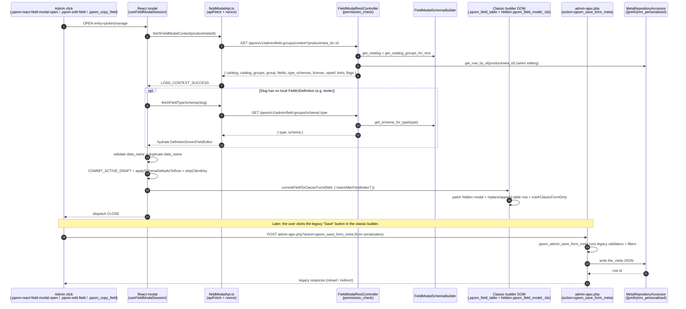

# React Field Modal Agent Guide

## Scope

This folder owns the opt-in React admin field modal for PPOM field groups. It replaces the classic field editing shell only when `ppom_use_react_field_modal()` is true, usually through `PPOM_USE_REACT_FIELD_MODAL`, `?ppom_react_modal=1`, or the `ppom_use_react_field_modal` filter.

The canonical saved payload is still the legacy PPOM field row array, stored as a JSON blob in the `the_meta` column of the PPOM meta table (`{prefix}nm_personalized`, defined as `PPOM_TABLE_META` in `woocommerce-product-addon.php`). All reads and writes go through `PPOM\Meta\MetaRepositoryAccessor` (see `classes/class-ppom-meta-repository.php`). React is an editing shell around that payload, not a new storage model.

## Entry Points

- `src/index.tsx`: mounts React into `#ppom-field-modal-root`, installs the REST nonce middleware from `window.ppomFieldModalBoot`, registers widgets and field UI definitions, and wraps the app in Chakra.
- `src/App.tsx`: composes the modal frame, body, footer, picker/manage modes, close confirmation, and back behavior.
- `src/hooks/useFieldModalSession.ts`: owns async orchestration for context loading, schema loading, saving, selection, dirty state, and picker transitions.
- `src/state/modalReducer.ts`: pure synchronous state transitions only.
- `src/adapters/wpAdminFieldModalAdapter.ts`: bridges classic admin buttons into React by listening to `.ppom-react-field-modal-open` (picker entry), and capturing `.ppom-edit-field` (manage entry) and `.ppom_copy_field` (duplicate-then-manage) clicks before legacy jQuery opens the PHP modal.
- `src/services/fieldModalApi.ts`: REST transport for context, field type schema, and save calls.
- PHP support lives in `src/Admin/FieldModal/*`. The root container is rendered from `templates/admin/ppom-fields.php`.

## Current Workflow

```mermaid
flowchart TD
    A["Admin field editor page"] --> B{"React modal enabled?"}
    B -->|No| C["Classic PHP inline modal"]
    B -->|Yes| D["Render #ppom-field-modal-root and enqueue build"]

    D --> E["index.tsx boots React on domReady"]
    E --> F["apiFetch nonce middleware from ppomFieldModalBoot"]
    F --> G["App -> useFieldModalSession"]

    G --> H["Bind open triggers"]
    H --> I["Add field button .ppom-react-field-modal-open"]
    H --> J["Edit row button .ppom-edit-field captured before legacy jQuery"]
    H --> JC["Copy row button .ppom_copy_field captured before legacy jQuery"]

    I --> K["OPEN entry=picker"]
    J --> L["OPEN entry=manage with selectFieldIndex"]
    JC --> L

    K --> M["GET ppom/v1/admin/field-groups/context"]
    L --> M

    M --> N["FieldModalRestController::get_context"]
    N --> O["FieldModalSchemaBuilder catalog + groups"]
    N --> P["Existing group row + decoded fields"]
    N --> Q["License, upsell, conditional repeater flags"]

    O --> R["LOAD_CONTEXT_SUCCESS"]
    P --> R
    Q --> R

    R --> S["withClientIds(fields)"]
    S --> T{"pickerOpen?"}

    T -->|Yes| U["FieldPickerPanel -> FieldTypePicker"]
    U --> V["addFieldOfType(slug)"]
    V --> W["ADD_FIELD_ROW default row"]
    W --> XN["pickerOpen=false; selectedId=new row"]

    T -->|No| XE["Select existing/first field"]

    XN --> Y["FieldManagePanel"]
    XE --> Y
    Y --> Z["FieldManageEditorBridge"]
    Z --> AA["TanStack Form owns active row values"]
    AA --> AB["onChange -> PATCH_FIELD_ROW_FROM_FORM"]
    AB --> AC["dirtyClientIds computed by stable serialized snapshots"]

    Z --> AD{"Route for field slug"}
    AD -->|definition| AE["DefinitionDrivenFieldEditor"]
    AD -->|legacyPhp/unknown| AF["UnknownSlugPanel + classic fallback CTA"]

    AE --> AG{"Schema source"}
    AG -->|local definition schema| AH["Use registered FieldUiDefinition"]
    AG -->|server schema needed| AI["GET ppom/v1/admin/field-groups/schema/:type"]

    AH --> AJ["FieldTabs + widgets + primitive controls"]
    AI --> AJ

    AJ --> AK["Save (modal footer)"]
    AK --> AL["Validate data_name + duplicate data_name in React"]
    AL --> AM["COMMIT_ACTIVE_DRAFT + applySchemaDefaultsToRow"]
    AM --> AN["stripClientKey(activeField)"]
    AN --> AO["adapters.admin.commitFieldToClassicForm"]
    AO --> AP["Patch hidden #ppom_field_model_:idx + .ppom_field_table row"]
    AP --> AQ["markClassicFormDirty() then CLOSE"]
    AQ --> AR["User clicks legacy Save in classic builder"]
    AR --> AS["POST admin-ajax.php?action=ppom_save_form_meta"]
    AS --> AT["ppom_admin_save_form_meta() runs legacy validators + filters"]
    AT --> AU["MetaRepositoryAccessor writes the_meta JSON"]
```



The React modal commits each edited row back into the classic builder's hidden form and DOM; it never calls the REST `POST` / `PUT` save endpoints. The on-disk write happens later, when the legacy classic-builder Save button submits to `admin-ajax.php?action=ppom_save_form_meta`. See the REST Endpoints section below for the precise active-vs-registered split.

## REST Endpoints

`FieldModalRestController::register_routes()` registers two **read-only** routes under the `ppom/v1` namespace, both gated by `permission_check` (`Helpers::security_role()`). The client wrappers live in `src/services/fieldModalApi.ts` and use `apiFetch` with the REST nonce middleware installed from `window.ppomFieldModalBoot`.

**Persistence is intentionally not over REST.** Save flows back through the classic builder's hidden form via `commitFieldToClassicForm`; the legacy `admin-ajax.php?action=ppom_save_form_meta` handler (registered in `classes/plugin.class.php` as `wp_ajax_ppom_save_form_meta` → `ppom_admin_save_form_meta`) is the single write path. This keeps the React shell on the same validators, filters, Pro hooks, and DOM hidden-input contract that the classic editor already exercises, so opt-in vs opt-out users converge on identical saved payloads.

| Method | Path                                      | PHP callback                                | Client wrapper           | When it fires                                                                                |
| ------ | ----------------------------------------- | ------------------------------------------- | ------------------------ | -------------------------------------------------------------------------------------------- |
| GET    | `ppom/v1/admin/field-groups/context`      | `FieldModalRestController::get_context`     | `fetchFieldModalContext` | On every modal open (picker or manage entry).                                                |
| GET    | `ppom/v1/admin/field-groups/schema/:type` | `FieldModalRestController::get_type_schema` | `fetchFieldTypeSchema`   | Lazy — only when the active slug has no local `FieldUiDefinition` (currently `texter`). |



### Endpoint guardrails

- Do not introduce new routes outside the `ppom/v1/admin/field-groups/*` prefix without updating this section and `FieldModalRestController`.
- Every new route must reuse `permission_check`. Do not weaken the capability check or shift it to per-request logic.
- Keep the context response shape additive — the client treats unknown keys as opaque, so adding fields is safe but renaming or removing them is a breaking change for the React shell.
- Server-schema loads (`/schema/:type`) are lazy and per-type. Do not eagerly prefetch every type; route registration via local `FieldUiDefinition` instances is the default path.
- Do not reintroduce a REST save endpoint without first migrating the legacy `ppom_save_form_meta` handler. Two parallel write paths would fork the validator and filter chains and break Pro integrations that hook the AJAX action. If you need a REST save, replace the legacy handler and update the classic builder to call REST too, in the same change.

## Data Flow Rules

- Keep `clientId` client-only. Always strip it with `stripClientKey()` (single row) before writing back to the classic form via `commitFieldToClassicForm`.
- Preserve unknown field row keys. Pro features and legacy filters may depend on keys this React modal does not render, so do not whitelist the row shape on the way out.
- Treat `data_name` as required when present, and reject duplicate `data_name` values inside the active builder before committing. The legacy AJAX save (`ppom_save_form_meta`) re-validates server-side.
- Do not treat React field values as sanitized. Final normalization, legacy filters, and `Validator::sanitize_array_data()` run on the server through `ppom_admin_save_form_meta` when the user clicks the classic Save button.
- Group-level settings are read straight from the classic builder DOM by the legacy save handler; the React modal does not own group-level controls today. If you add them, write back into the existing hidden inputs rather than introducing a parallel payload.
- Do not change the saved wire shape unless the legacy `ppom_save_form_meta` handler and the classic builder's hidden inputs are updated together. The React modal is an editing shell on top of that shape, not a new storage format.

## Editor Architecture

- Prefer definition-driven editors through `definitions/builtinFieldUiDefinitions.ts` and the widget registry.
- Register common widgets in `widgets/registerDefaultFieldWidgets.tsx`; use a dedicated widget module when the widget has meaningful local behavior.
- Normal supported fields should render through `DefinitionDrivenFieldEditor` and `FieldTabs`.
- Unsupported, unknown, or explicitly classic-only slugs should route through `UnknownSlugPanel`; do not silently drop, rewrite, or partially save unsupported field data.
- Only fetch server schema when a local definition is unavailable or explicitly required. At the time of writing, `texter` is the explicit server-schema case.

## React And Form Guardrails

- Keep `modalReducer` pure. Put async work in hooks or service modules.
- Do not move REST calls, DOM listeners, timers, or other side effects into the reducer.
- Be careful changing `FieldManageEditorBridge`. It intentionally passes TanStack Form `defaultValues` only during the first options object after mount to avoid stale parent snapshots overwriting active inputs.
- Do not remove the bridge remount by `key={editDraft.clientId}` unless replacing the form sync strategy.
- Preserve dirty tracking based on stable serialized persisted rows after stripping client-only IDs.
- Keep `setEditDraft` updates flowing through `PATCH_FIELD_ROW_FROM_FORM` so dirty state, selected row state, and save payloads stay aligned.

## UI And Integration Guardrails

- Use Chakra components and the existing `fieldModalTheme`.
- Keep modal z-index below the WordPress media modal. Respect `utils/mediaLock.ts` for interactions with `wp.media()`.
- Do not bypass `wpAdminFieldModalAdapter` with parallel legacy jQuery modal handlers.
- Keep the modal opt-in compatible with the classic builder table and per-row edit buttons.
- Keep accessibility labels stable when tests or classic admin workflows rely on them.

## Verification

For documentation-only changes, inspect the rendered Markdown and confirm the Mermaid diagram is valid.

For behavior changes in this folder, run focused checks:

```bash
npm run lint:modal
npm run build:admin-field-modal
npm run test:e2e -- tests/e2e/specs/react-field-modal.spec.js
```

The E2E command runs against `@wordpress/env` (`wp-env`). The bootstrap MU plugin and fixture helpers live in `bin/wp-env/mu-plugins/ppom-e2e-bootstrap.php` and `tests/e2e/fixtures/`; see `tests/e2e/AGENTS.md` for environment setup, fixture conventions, and when to prefer `fixtures/` over `utils.js`. If wp-env is not available, record that limitation and run the lint/build checks instead.
